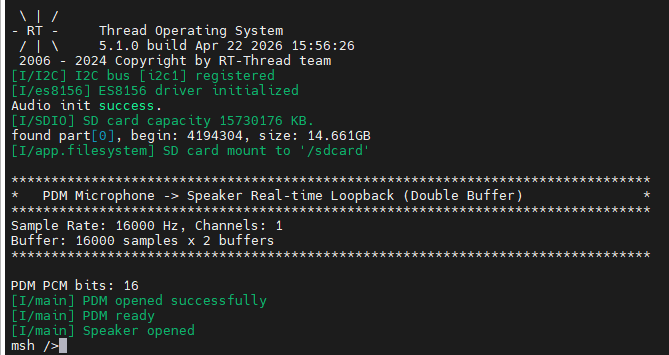

# PDM Microphone Real-time Loopback Example Guide

## Introduction

This example demonstrates how to use the **RA8P1 PDM (Pulse Density Modulation) Interface** on **Titan Board Mini** to read audio from a **PDM Microphone** and play it back in real-time through the **ES8156 Audio Codec**, implementing a **Microphone → Speaker** audio loopback function.

Main features include:

- PDM microphone data acquisition using RA8P1 built-in PDM interface
- PDM to PCM format conversion (supports 16-bit and 20-bit modes)
- Mono to stereo audio processing
- Double-buffer mechanism for continuous audio streaming
- Audio output via SSI interface and ES8156 codec

## Hardware Introduction

### 1. PDM Microphone

The **Titan Board Mini** features an onboard **PDM Microphone**:

| Parameter | Description |
|-----------|-------------|
| **Type** | MEMS PDM Microphone |
| **Interface** | PDM (Pulse Density Modulation) |
| **Output Format** | 1-bit density stream |
| **Sample Rate** | Up to 16kHz (this example) |
| **Channels** | Mono |

### 2. RA8P1 PDM Interface

RA8P1 PDM interface features:

- **Built-in PDM demodulator**: Hardware PDM → PCM conversion
- **Configurable filters**: SINC filter, HPF, LPF
- **Multi-channel support**: Supports multiple microphone inputs
- **Configurable output**: Supports 16-bit or 20-bit PCM output
- **DMA support**: DMA transfer support, reducing CPU usage

### 3. Audio Output

- **Codec**: ES8156 (24-bit DAC, supports 8kHz - 192kHz)
- **Interface**: SSI (I2S protocol)
- **Output**: 3.5mm headphone jack / onboard speaker

## Software Architecture

### 1. Data Flow

```
PDM Microphone
    ↓ (PDM signal)
RA8P1 PDM Interface
    ↓ (Hardware filtering + PDM→PCM)
PDM Buffer (int32_t[])
    ↓ (Software conversion)
DAC Buffer (int16_t[], stereo)
    ↓ (I2S protocol)
ES8156 Codec
    ↓ (Analog audio)
Speaker/Headphone
```

### 2. Core Components

#### PDM Driver

Using Renesas FSP PDM driver:

```c
/* Open PDM module */
R_PDM_Open(&g_pdm0_ctrl, &g_pdm0_cfg);

/* Start data acquisition */
R_PDM_Start(&g_pdm0_ctrl, buffer, buf_size.bytes, samples);

/* Stop acquisition */
R_PDM_Stop(&g_pdm0_ctrl);

/* Close PDM module */
R_PDM_Close(&g_pdm0_ctrl);
```

#### Data Conversion Function

```c
/* PDM data to DAC data conversion */
static void convert_pdm_to_dac(int32_t *pdm_data, uint32_t pdm_samples, int16_t *dac_data)
{
    for (uint32_t i = 0; i < pdm_samples; i++)
    {
        int16_t sample_16;
        if (g_pcm_bits == PCM_20BITS)
        {
            /* 20-bit -> 16-bit: shift right 4 bits */
            sample_16 = (int16_t)(pdm_data[i] >> 4);
        }
        else
        {
            /* 16-bit mode: shift left 1 bit */
            sample_16 = (int16_t)(pdm_data[i] << 1);
        }

        /* Mono to stereo */
        dac_data[i * 2] = sample_16;      /* Left channel */
        dac_data[i * 2 + 1] = sample_16;  /* Right channel */
    }
}
```

### 3. Double Buffer Mechanism

To achieve continuous audio streaming, a double-buffer mode is used:

```
Timeline:
    t0      t1      t2      t3      t4
    |-------|-------|-------|-------|
Buffer 0: [Record ] [Play         ]
Buffer 1:                 [Record ] [Play         ]
```

- **Buffer 0**: Record → Play
- **Buffer 1**: Record → Play
- Two buffers alternate for seamless continuous playback

### 4. Project Structure

```
Titan_Mini_pdm/
├── src/
│   └── hal_entry.c          # Main program entry
├── libraries/
│   └── HAL_Drivers/
│       ├── drv_i2s.c        # SSI/I2S driver
│       └── ports/
│           └── es8156/      # ES8156 codec driver
└── ra_gen/
    └── hal_data.c           # FSP configuration (PDM, SSI, etc.)
```

## Configuration

### 1. PDM Configuration

Configure PDM parameters in `ra_gen/hal_data.c`:

```c
const pdm_cfg_t g_pdm0_cfg =
{
    .unit                              = 0,
    .channel                           = 2,        /* PDM channel */
    .pcm_width                         = PDM_PCM_WIDTH_16_BITS_0_14,  /* 16-bit output */
    .pcm_edge                          = PDM_INPUT_DATA_EDGE_RISE,
    .p_extend                          = &g_pdm0_cfg_extend,
    // ...
};
```

### 2. Key Parameters

| Parameter | Value | Description |
|-----------|-------|-------------|
| `PDM_FS_HZ` | 16000 | Output sample rate 16kHz |
| `PDM_CHANNELS` | 1 | Mono input |
| `PDM_PCM_WIDTH` | 16_BITS_0_14 | 16-bit PCM, valid bits [14:0] |
| `NUM_BUFFERS` | 2 | Double buffer mode |
| `PDM_RECORD_DURATION_SEC` | 1 | 1 second audio per buffer |

## Run Effect



1. After power-on, green LED lights up indicating system ready
2. Blue LED lights up indicating audio loopback is running
3. Speak into the microphone and hear your voice in real-time through headphones/speaker
4. Blue LED blinks every 50 cycles (heartbeat indicator)

## Troubleshooting

### 1. No Audio Output

- Check if headphones/speaker are properly connected
- Check volume settings (default 60%)
- Verify ES8156 initialization was successful

### 2. Audio Stuttering

- Current uses 1-second buffer, try adjusting `PDM_RECORD_DURATION_SEC`
- Check system load, reduce other tasks

### 3. Audio Distortion

- Verify `pcm_width` configuration matches hardware
- Adjust shift parameters in data conversion function

## Further Reading

- [Renesas RA8P1 Hardware Manual](https://www.renesas.com/us/en/products/microcontrollers-microprocessors/ra-cortex-m-mcus/ra8p1-480-mhz-arm-cortex-m85-based-microcontroller-helium-to-trace)
- [ES8156 Datasheet](https://www.everest-semi.com/products/details/ES8156)
- [RT-Thread Audio Framework Documentation](https://www.rt-thread.io/document/site/#/rt-thread-version/rt-thread-standard/programming-manual/device/audio/audio)
